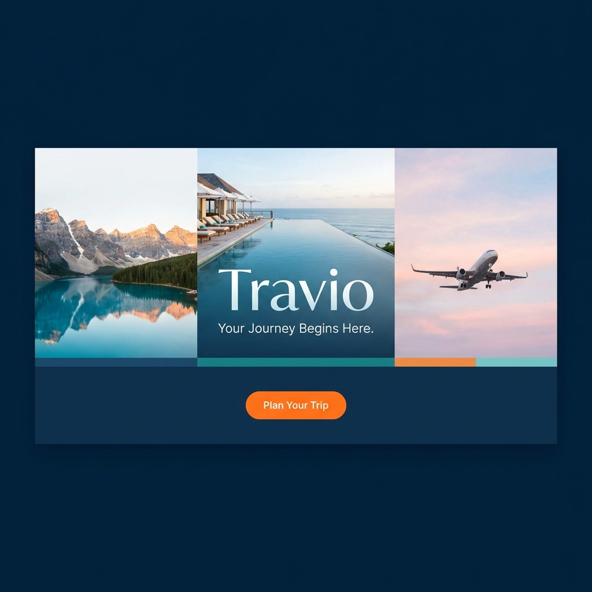
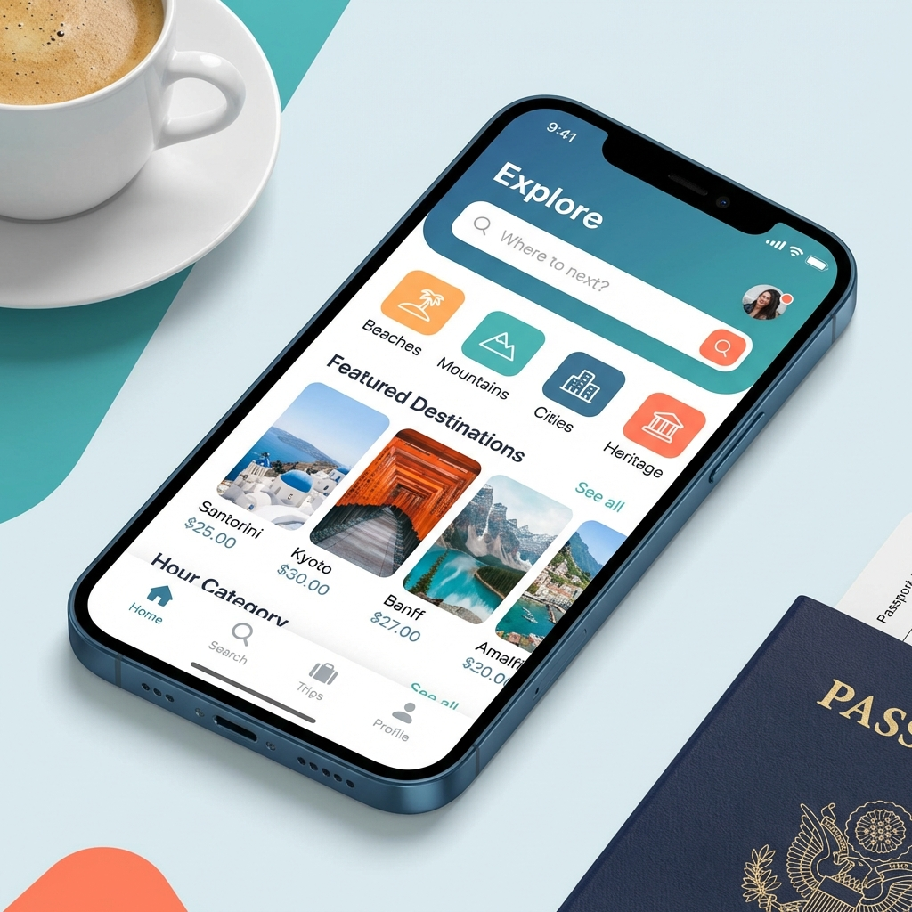
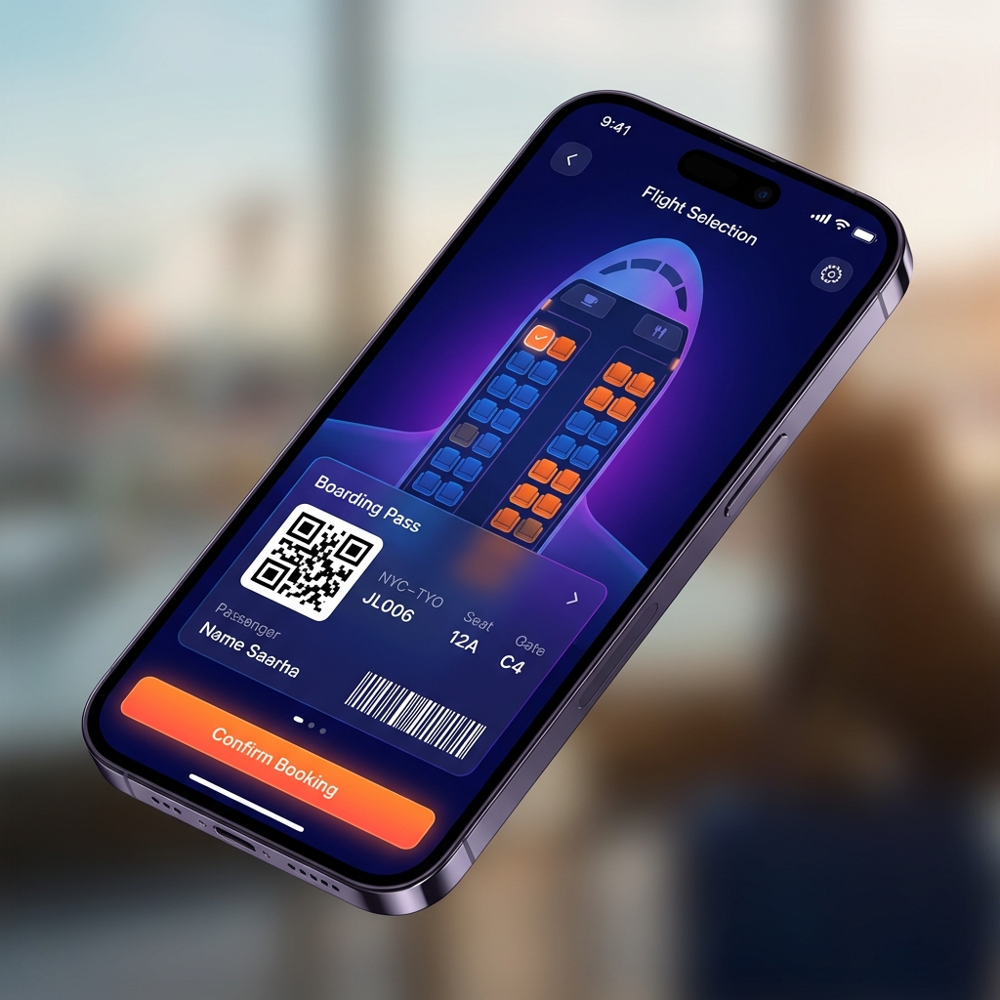

# <p align="center">  </p>

<p align="center">
  
  
  
  
  
</p>

<p align="center">
  
</p>

---

## 🌎 Overview

**Travio** is a premium, high-fidelity travel ecosystem designed to revolutionize the way people explore, plan, and book their journeys. Built with a "Mobile-First" and "Luxury" philosophy, Travio seamlessly integrates destination discovery, high-end hotel reservations, flight management, and interactive mapping into a single, cohesive, and visually stunning mobile experience.

Whether you're looking for the serene mountains of **Hunza**, the historic streets of **Lahore**, or the juniper forests of **Ziarat**, Travio provides a curated gateway to the world's most beautiful destinations.

---

## ✨ Key Features & Modules

### 🔐 Advanced Authentication & Onboarding
- **Dynamic Onboarding:** A visually immersive entry into the app using advanced animations.
- **Secure Auth Suite:** Robust Login, Signup, OTP Verification, and Forgot Password flows with sleek UI.
- **User Profiles:** Personalized user experiences with editable profiles and preferences.

### 🗺️ Intelligent Exploration
- **3D Destination Carousel:** Experience destinations like never before with interactive 3D perspective browsing.
- **Explore Hub:** A dedicated space to discover cities, attractions, and local events.
- **Interactive Maps:** Real-time visualization of destinations and nearby points of interest.
- **Ziarat Integration:** Recently added dedicated support for the majestic Ziarat residency and surrounding juniper forests.

### � Elite Booking System
- **Luxury Stays:** Comprehensive hotel booking engine with detailed descriptions, facility lists, and rating systems.
- **Flight & Transport:** Manage flight details, select seats, and book local cab services (Hotels, Cabs, Events).
- **Digital Boarding Pass:** Instant generation of QR-coded boarding passes for a paperless travel experience.

### 👤 Personal Concierge
- **My Trips:** Manage all your upcoming and past bookings in a clean, organized timeline.
- **Saved Treasures:** Bookmark your favorite destinations for future planning.
- **Settings & Privacy:** Full control over notifications, dark mode (experimental), and data policies.

---

## 📸 Visual Showcase

<p align="center">
  
  
</p>

---

## 🛠️ Technical Stack

- **Framework:** [Flutter SDK](https://flutter.dev) (v3.35.7+)
- **Language:** [Dart](https://dart.dev) (v3.9.2+)
- **UI & Animations:** `flutter_animate` for premium micro-interactions.
- **Typography:** `google_fonts` (Outfit as primary font).
- **Mapping:** `flutter_map` with `latlong2` & `geolocator`.
- **Utilities:** `qr_flutter` (Ticketing), `share_plus`, `url_launcher`, `intl`.

---

## 📂 Project Structure

```text
lib/
├── core/               # Design System (Colors, Theme, Typography)
├── models/             # Data Models (Destination, Hotel, Trip, etc.)
├── screens/            # 40+ Feature-rich UI Screens
│   ├── auth/           # Authentication Workflow
│   ├── booking/        # Hotels, Flights, Cabs Integration
│   ├── explorer/       # Maps, Search, Discover
│   └── profile/        # Settings, Digital Tickets, Privacy
├── widgets/            # Reusable Premium UI Components
└── main.dart           # App Entry Point
```

---

## 🚀 Version Log (v2.3.0)

### v2.3.0 - The Destination Update
- **New Destinations:** Integrated high-resolution imagery and data for **Ziarat**, **Swat**, and **Skardu**.
- **UI Enhancement:** Added dedicated "Ziarat Card" with professional asset management.
- **Asset Optimization:** Improved image loading performance and error handling for remote assets.
- **Bug Fixes:** Resolved minor navigation overflows and updated deprecated member usages.

### v2.1.0 - The Global Update
- Added support for multiple local attractions in major cities.
- Updated theme engines for better contrast and accessibility.

### v1.0.0 - Initial Release
- Core booking engine and exploration hub.

---

## ⚙️ Setup & Installation

### Prerequisites
- [Flutter SDK](https://docs.flutter.dev/get-started/install) installed.
- Android/iOS Emulator or Physical Device.

### Steps
1. **Clone the Repo:**
   ```bash
   git clone https://github.com/Choudhary-Khuzaim/travio.git
   ```
2. **Install Dependencies:**
   ```bash
   flutter pub get
   ```
3. **Run the App:**
   ```bash
   flutter run
   ```

---

## 🤝 Support & Contribution

We welcome contributions! If you'd like to improve Travio:
1. Fork the project.
2. Create your Feature Branch (`git checkout -b feature/AmazingFeature`).
3. Commit your changes (`git commit -m 'Add some AmazingFeature'`).
4. Push to the Branch (`git push origin feature/AmazingFeature`).
5. Open a Pull Request.

---

## 📄 License
This project is licensed under the **MIT License**.

---

<p align="center">
  <b>Developed with ❤️ by</b><br>
  <a href="https://github.com/Choudhary-Khuzaim">Khuzaim Sajjad</a><br><br>
  
</p>
